# CSS  
CSS adalah Bahasa yang digunakan untuk mendesain halaman website.  
Dengan CSS, kita bisa mengubah warna, menggunakan font custom, editing text format, mengatur tata letak, dan lainnnya.  

Struktur CSS :  

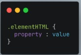  

Merupakan selector. Selector maksudnya adalah bagian mana yang mau distyling.  

Agar lebih muda memahami code antar sesame programmer dapat menggunakan CSS Comment. Kita dapat memberikan penjelasan maksud dari line code yang kita kerjakan. Comment ini pasti sealalu ada dalam Bahasa pemrograman apapun.  

Contoh comment :  

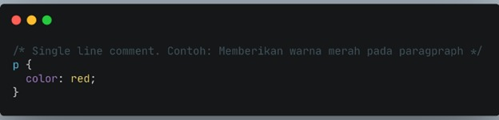  

 

**Cara menggunakan CSS**
* Inline style  
adalah kita menambahkan CSS pada atribut element HTML  

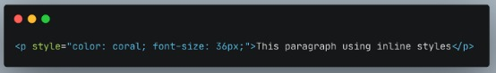  

* Internal  
Menggunakan element   di dalam elemen    

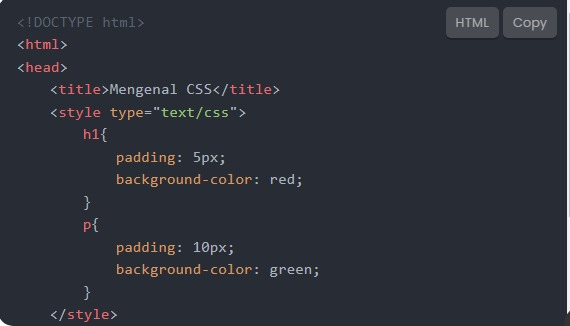  

* External  
Menggunakan elemen   di dalam elemen    

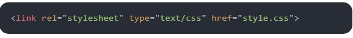

 

**Tag Name**  
Kita bisa menggunakan Tag Elemen HTML secara kangsung pada CSS. JIka menggunakan tag Element, maka ini bersifat global. Global artinya akan mempengaruhi seluruh Tag Elemen HTML yanga da pada file tersebut.  
Contoh penggunaan :  
Kita akan mengubah   pada code berikut :  

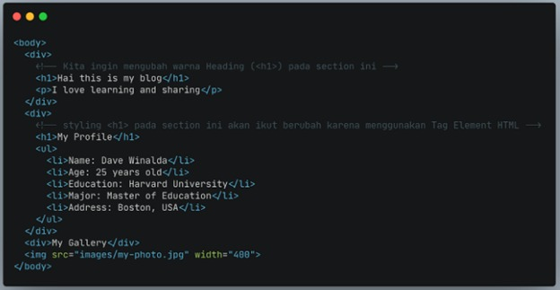  

Jika kita memasukkan code CSS  

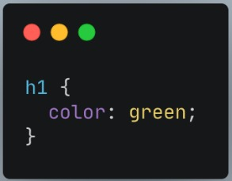  

Maka akan menghasilkan :  

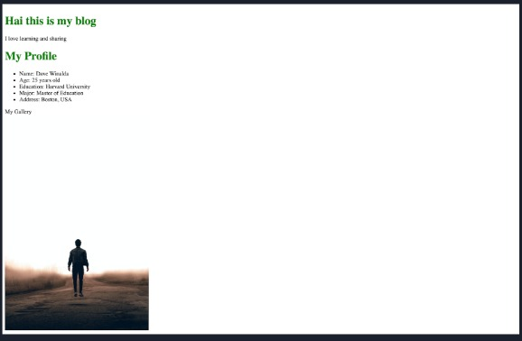  

 

**CSS Class Name**  
Kita bisa menggunakan atribut clss pada elemen HTML lalu memanggil nama class tersebut. HTML yang memiliki class yang sama, akan mempunyai styling yang sama saat digunakan pada CSS.  
Contoh code yang memiliki class yang sama :  

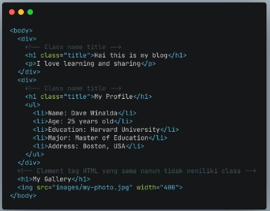  

Style css dengan memanggil class dari attribute elemen tag HTML  

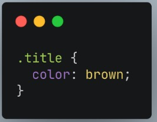  

Maka akan menghasilkan tampilan :  

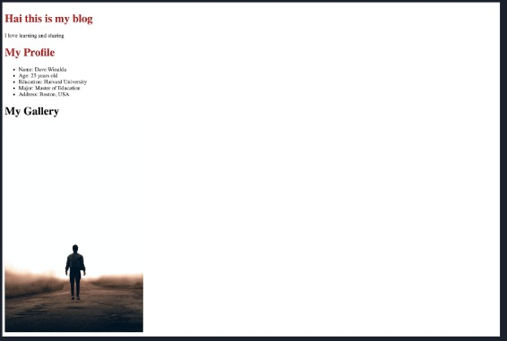  

Walapun ketiga heading memiliki element tag yang sama, tidak membuat styling/desain yang sama untuk ketiga heading karena menggunakan class.  
> Gunakan (.) saat memanggil clss pada CSS  

 

**CSS Multiple Clss**  
Kita dapat menggunakan lebih dari 1 clss yang berbeda untuk 1 elemen HTML.  
Semisal kita memiliki 2 heading. Kita ingin memiliki warna yang sama. Tapi, kita ingin format heading yang satu huruf besar (uppercase) dan heading yang huruf kecil (lowercase).  
Pada file html :  

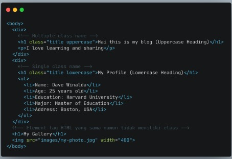  

Pada file CSS :  

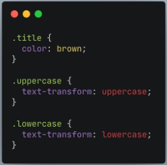  

Maka akan menghasilkan :  

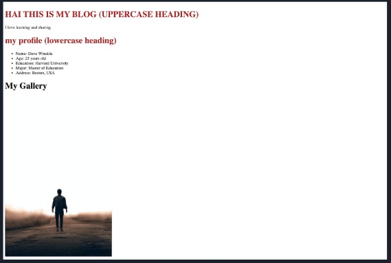  

 

**CSS-ID Name**  
ID Name bersifat unik artinya hanya ada 1 nama ID ada 1 element HTML. Biasanya digunakan jika hanya ada 1 element pada 1 page.  
Contohnya : navigator header dan footer  
> Gunakan (#namaID) saat memanggil element ID HTML pada CSS  
Contoh file HTML dengan ID attribute pada section navigation :  

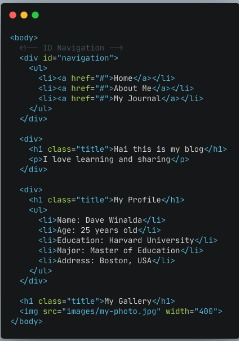  

Pada style css nya :  

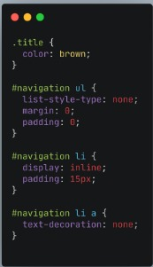  

 Maka akan menghasilkan :

 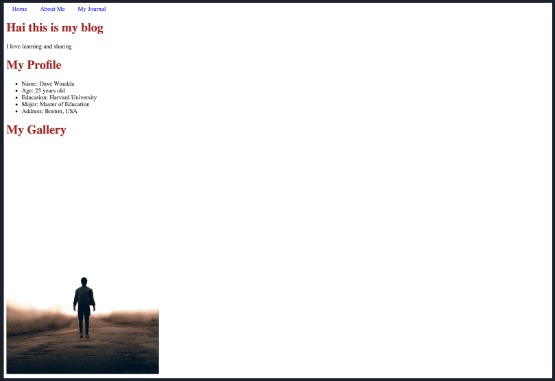  

 Perbedaan Class Name dengan ID Name :
 * Gunakan ID Name jika hanya ada 1 elemen pada file/halaman HTML.
 Contohnya navigation dan footer
 * Gunakan Class Name jika aka nada beberapa element HTML yang memiliki styling/desain yang sama.
 Contohnya : 
-	Kita ingin Heading Blog kita memiliki desaun yang sama
-	Kita ingin setiap link memiliki styling/desain yang sama  

 

**Nasted Element**  
Konsep CSS sama dengan HTML yaitu setiap element memiliki parent dan child.  
Pada HTML :  

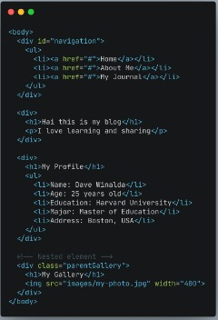  

Pada CSS :

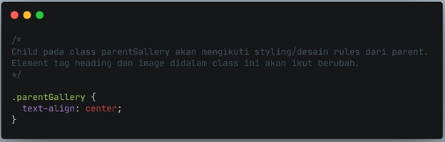  

Maka akan menghasilkan :

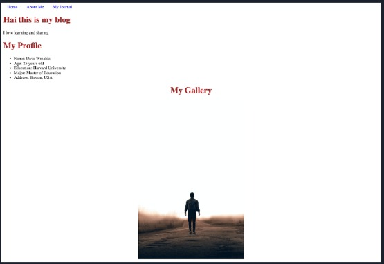  

 

**!important CSS**  
!important CSS berada di level paling atas dari ID dan Class.  
Maksudnyanya adalah jika pada styling CSS kita menggunakan !important, maka styling sebelumnya baik itu ID Name atau Class Name akan di override.  
Contoh pada file HTML :  

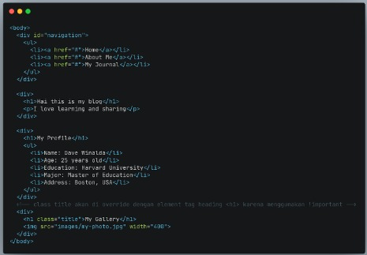  

Pada file CSS :

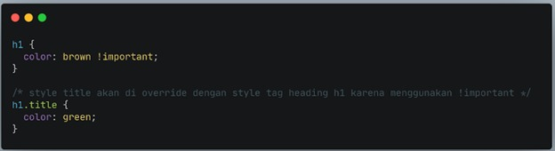  

Maka akan menghasilkan :  

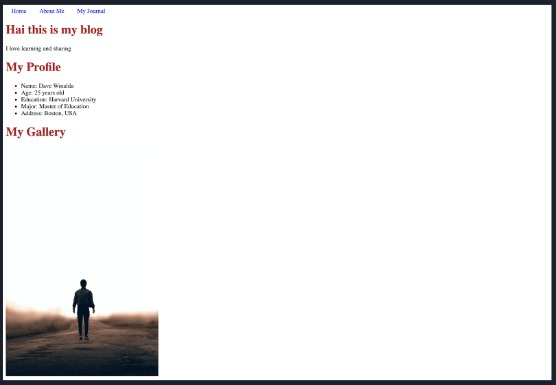  

 

Note book :  

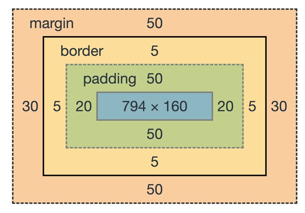  

> Margin adalah itu jarak keluar box model  

> Padding adalah  jarak di dalam kotak  

> Block adalah menguasai satu layer  

> Inline : menguasai konten aja  

> Statis : posisi secara default  

> Statis itu ditempatkan sesuai dengan nulis element  

> Statis : berarti dia memiliki wilayahnya sendiri  

> Relative bisa dipindahin  

> Posisi absolut akan mengikuti posisi induknya yang relative  

> z-index gunanya untuk mengatur posisi  

> Posisi absolute akan selalu mengikuti relative  

> Jikalau hendak  membuat tulisan dan gambar sebelah belahan memakai display: flex  

> flexbox istilahnya (terminalogi kalau pengen menggunakan flex display)  

> Repository : tempat kia menyimpan kerjaa.progress  

> Local : kerjaan/ progress yang masih ada di device  

> Push : mengirim kerjaan/progress ke github repository

