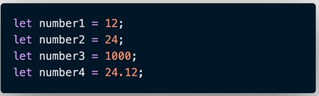

# Javascript Dasar  
Javascript adalah Bahasa pemograman yang sangat powerful yang digunakan untuk logic pada sebuah website.  
Javascript juga dapat membuat website menjadi interaktif dan dinamis.  

 

**Syntax dan Statement**  
Syntax juga bisa dianologikan sebagai kosa kata (vocabulary) dan atata cara (grammar) pada Bahasa pemograman.  

 

**Console Log**  
Console Log adalah hal yang krusial bagi developer web. Console log adalah tempat kita untuk cek logic pemograman web yang kita kembangkan. Console Log juga tempat kita untuk melakukan debugging.  
Bentuk console log :  

  

 

**Tipe Data**  
Tipe data adalah hal klasifikasi yang kita berikan untuk berbagai macam data yang digunakan dalam programming.  

Ada 6 tipe data fundamental pada Javascript :  
1. Number  
Tipe data yang mengandung semua angka termasuk decimal.  

  

2. String  
Group karakter yang ada pada keybord laptop.PC kita yaitu letters (huruf), number (angka), spaces (spasi), symbol dan lainnya.  
Diawali dengan “ “ atau ‘ ‘  

   

3. Boolean  
Tipe data yang mempunyai 2 buah nilai  yaitu True dan False.

  

4. Null
Tipe data yang diartikan bahwa sebuah variable/data tidak memiliki nilai.  

  

Maka akan menghasilkan di console  

  

5. Undefined  
Tipe data yang merepresentasekan variable/data yang tidak memilik nilai.   
Tipe data null biasanya diperoleh dalam kondisi normal dan sudah kita rencanakan. Tipe data undefined biasanya didapat dari hasil kesalahan program (error), kelalaian programmer, dan tidak direncanakan.  
Contoh :  

  

Hasil console  

   

6. Object  
Koleksi data yang saling berhubungan (related). Tipe data object dapat menyimpan data dengan tipe data apapun (number, string, Boolean, dan lainnya).  
Tipe data object mempunyai key dan value.  

  

 

**Variabel**  
Variabel adalah container/tempat untuk menyimpan sebuah nilai.  

Tiga hal yang dapat dilakukan pada variable :  
* Membuat variable dengan nama yang jelas dan menggambarkan tentang data tersebut
* Menyimpan dan mengupdate informasi, data yang disimpan
* Mendapatkan/menampilkan data yang tersimpan  

Ada 3 cara mendefenisikan variabel :  
* Var

  

* Let  

  

* Const  
Gunakan const jika variable tidak dapat diubah nilainya.  
Biasanya digunakan untuk menggambrkan konstanta sebuah nilai, seperti konstanta pi=3.14  

  

Perbedaan Var dan Let :  
* Let dikenalkan pada versi javascript terbaru ES6
* Variabel let mendukung kaidah global variable dan local variable  

Aturan Penamaan Variabel :
* Harus meneskripsikan tentang data yang disimpan
* Tidak bisa menggunakan number pada awal nama variable
* Gunakan camelCase untuk penamaan yang lebih dari 1 kata  

 

**Operator**  
* Assignment Operator (=)  
Digunakan untuk menyimpan sebuah nilai pada variable  

  

* Mathematical Assignment Operator  

  

* Increment dan Decrement  
Untuk menambah atau mengurangi 1 nilai  

  

* Arithmetic Operator  
Operator yang melibatkan operasi matematika  
Tambah (+)
Kuramg (-)
Perkalian (*)
Pembagian (/)
Modulus (%)  

  

* Logical operator  
Akan menghasilkan nilai Boolean yaitu True or False  
Simbol :  
1. And &&  

  

Contoh kasus :  

  

2. Or ||  

  

Contoh kasus :  

  

3. Not !  
Not akan mengembalikan sebuah nilai Boolean. True menajdi false dan sebaliknya  

  