# Looping  
Looping adalah statement yang mengulang sebuah instruksi hingga kondisi teroenuhi atau jika kondisi stop/berhenti tercapai.  

 

**Manual Looping**  

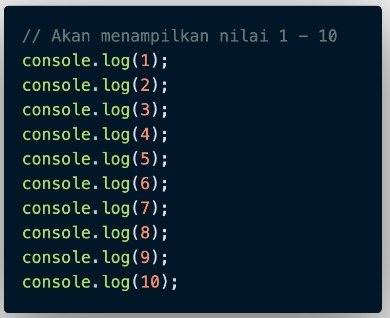  

 

**For Loop**  
For Loop merupakan instruksi pengulangan yang dapat kita berikan pada program yang kita kembangkan.  
Menggunakan For Loop jika kita mengetahui banyak nilai pasti untuk pengulangan.  

**For loop Parameter**
* Inisialisasi  
Sebagai inisialisasi awal dari mana mulainya sebuah pengulangan. Kita memberikan nilai awal/default pada parameter ini
* Condition  
For loop akan terus berjalan selama kondisi ini terpenuhi. Selama kondisi bernilai TRUE.
* Post-expression (Increment/Decrement)  
Literasi statement yang digunakan untuk mengupdate variabel yang menjadi kontrol pada pengulangan  

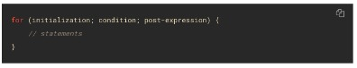  

Jika dimasukkan variable :  

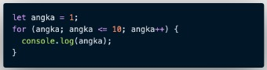  

 

**While Loop**  
While Loop akan menjalankan instruksi pengulangan kondisi bernilai True  
While Loop digunakan jika kita tidak mengetahui jumlah pasti pengulangan  

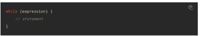  

Jika dimasukkan variable/contoh :  

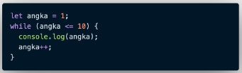  

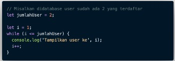  

Hasil console :  

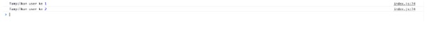  

 

**Do While**

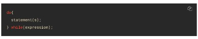  

Contoh kasus :  

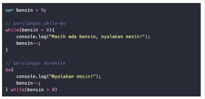  

Maka hasilnya akan :  

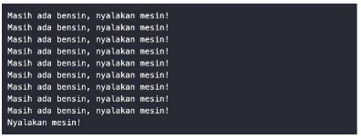  

 

**Nested Loop**  
Jika kita membuat looping di dalam looping, maka dinamakan Nested Loop.  
Looping pertama dianologikan sebagai baris  
Looping kedua dianologikan sebagai kolom  
Contoh :  

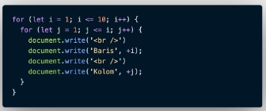  

Maka akan menghasilkan :  

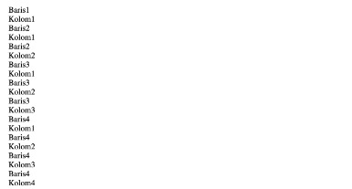 