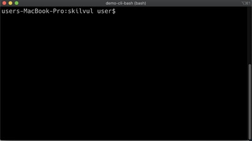
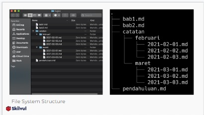

# UNIX COMMAND LINE
Aplikasi dibagi atas 2 yaitu :  
1. GUI (Graphic User Interface)  
2. CLI (Commond Line Interface)  
  
Di CLI terdapat apk yang dinamakan shell. Shell adalah perintah-perintah yang digunakan untuk mengintruksikan sistem operasi.  
Di dalam sistem computer dapat dibuat urutannya : 
* File Explorer
* Shell 
* OS 
* Hardware

Ada berbagai jenis shell seperti di windows terdapat powershell, kornshell, bourn again shell (bash).

Contoh Commond Line Interface (CLI) :
* SH
* Bash
* Zsh
* Cmd.exe

CLI merupakan bawaan sistem operasi contohnya adalah cmd.exe milik Windows atau bash dan zsh di sistem operasi mirip Unix.

CLI adalah shell yang berbasis teks. Shell adalah program yang menerima perintah, kemudian meneruskan perintah tersebut ke system untuk diekseskusi. Selain command line, ada juga yang disebut dengan shell berbasis grafis yang lebih dikenal dengan GUI atau graphical user interface.  
 Macam-macam GUI : 
-	Microsoft Windows 
-	macOS
-	Ubuntu  

Kebanyakan cara-cara development menggunakan cara-cara linux.

Bash (bourne again shell) adalah salah satu aplikasi shell. Bash identic dengan unix, unix adalah linux.

Pwd berfungsi intuk mengetahui lokasi kita berada.

Terminal emulator adalah apk yang digunakan untuk mengakses CLI.

Tampilan saat pertama kali membuka terminal. Yang disebut juga dengan shell prompt dan tampilan ini muncul ketika shell siap menerima input.  

  
   

### Filesystem  

* Sebuah filesystem mengatur bagaimana data disimpan di dalam sebuah system  
* Sistem operasi Windows dan Unix-like menyusun file dan direktori menggunakan struktur yang bentuknya mirip tree

Contoh :  
   
Root directory adalah direktori paling atas atau yang paling pertama.

 

**Command untuk Navigasi di Gitbash :**  
* Pwd : (Print working directory)  
untuk melihat current working directory  
* ls : (lists)  
untuk melihat isi file yang ada di sebuah direktori
* cd <direktori> : (change directori)  
untuk berpindah direktori

 

**Membuat files dan direktori**  
Dalam membuat files dan direktori dapat menggunakan :  
* touch : command untuk membuat sebuah file
* mkdir : command untuk membuat sebuah direktori

 

**Untuk melihat isi file dapat menggunakan :**
* head : untuk melihat beberapa line awal dari sebuah file text
* tail : untuk melihat beberapa line awal dari sebuah file text
* cat : untuk melihat isi sebuah file

 

**Menyalin, memindahkan dan menghapus files dan directory  dapat menggunakan :**  
* cp : untuk mengcopy files atau directory
* mv : untuk memindahkan files atau directory. Bisa digunakan untuk rename
* rm : command untuk menghapus file atau directory

   
