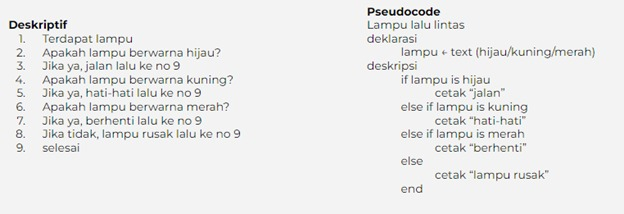

# Algoritma  
Programming identic dengan memecahkan suatu permasalahan, maka algoritma merupakan pemeran utamanya. Bahasa pemograman hanyalah pemeran pendamping. Belajar algoritma sama saja dengan mengingat kembali alur berfikir yang terstuktur.  

Ciri-ciri algoritma :  
* Input : memiliki 0 atau lebih inputan
* Output : memiliki min 1 buah output
* Definiteness : instruksi jelas tidak ambigu
* Fin9teness : memiliki titik berhenti (stop)
* Effectiveness : sebisa mungkin tepat sasaran dan efesien  

 

Algoritma memiliki berbagai macam proses :
* Sequence 
Instruksi yang dijalankan secara beururutan
* Selection
Instruksi yang dijalankan jika memenuhi suatu kondisi
* Iteration
Intruksi yang berulang kali dijalankan selama memenuhi suatu kondisi
* Concurrent
Intruksi yang dijalankan secara bersamaan  

 

Algoritma dapat ditulis dengan cara :  
* Deskriptif
Seperti kita menulis tutorial (tata cara) dengan Bahasa sehari-hari  
* Flow Chart  
Atau disebut juga diagram alir, penyajian algoritmanya lebih mudah dibaca karena memiliki tampilan visual. Flow chart menggunakan symbol bangun datar sebagai representasi dari proses yang dilakukan.  
Contoh Flow Chart :  

  

* Pseudo Code
Penulisan algoriitma yang hamper menyerupai penulisan pada kode pemograman.  
Contoh :

  

 

Pada umumnya pseudocode memiliki 3 bagian :  
* Judul 
Penjelasan dari algoritma yang dibuat
* Deklarasi
Mendefenisikan/meyiapkan semua nama (variable) yang akan digunakan
* Deskripsi
Langkah-langkah penyelesaian masalah  

 

Tidak ada aturan baku dalam penulisan pseudocode, asalkan :  
* Jelas
* Simple
* Konsisten
* Dan mudah dibaca orang lain  

Contoh Algoritma :

  

