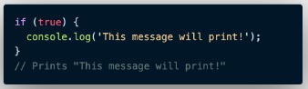

# Conditional  
Conditional merupakan statement percabangan yang menggambarkan suatu kondisi.  
Conditional statement akan mengecek konidis spesifik dan menjalankan perintah berdasarkan kondisi tersebut.  
Yang dicek apakah kondisi tersebut True (benar). Jika True maka code di dalam kondisi tersebut dijalankan.  

 

### Contoh Conditional :  

**If Statement**  

   

  

  

  

 

**Conditional If… Else Statement**  
Else akan mengeksekusi sebuah statement/code jika suatu kondisi bernilai False.  

  

 

**If.. Else If Statement**  
Else… If statement dapat kita gunakan jika kita mempunyai berbagai kondisi.  

  

 

**Truthy and False**  
Truthy and falsy digunakan untuk mengecek apakah variable telah terisi namun tidak mementingkan nilainya.  

  

 

**Truthy and Falsy Assignment**  
Analoginya adalah jika kita memiliki sebuah website dan meminta inputan username, lalu menampilkannya. Jika username kosong kita bisa isi nilai tersebut.  

  

 

**Switch Case Conditional**  
Digunakan jika kondisi dan percabangan terlalu banyak.  

  

 

**Ternary Operator**  
Merupakan short-syntax dari statement if..else. 

 