# HTML
HTML adalah singkatan dari Hypertext Markup Languange. HTML digunakan untuk menampilkan konten pada browser.  
Contoh konten yang daoat ditampilkan seperti :  
* Text 
* Image
* Video
* Link
* dll  

HTML bersifat statis. HTML hanya bertugas menampilkan konten yang diminta oleh developer.  
HTML bukanlah sebuah Bahasa pemograman, artinya HTML tidak dinamis mengolah data.  
Ada 2 tools utama yang harus dipersiapkan untuk membuat HTML :  
* Browser
* Code Editor  

 

### Visual Studio Code  
Code editor yang digunakan salah satunya adalah Visual Studio Code. Visual Studio Code adalah code ditor yang dikembangkan oleh tim engineer Microsoft. Visual Studio Code dapat digunakan untuk Bahasa pemrograman apapun.  
Keunggulan visual studio code adalah :  
* Intelisense
* Run and debug
* Built-in Git
* Extensions  

Contoh extensi yang dapat digunakan :  
* Auto close tag
* Auto rename tag
* Color picker
* Live server
* prettier  

Tampilan Visual Studio Code :  
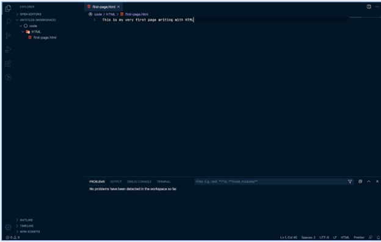 

 

**Struktur HTML**  
HTML tersusun sebagai kesatuan dari sebuah tingkatan (family tree relationship). Saat sebuah element berada di dalam element lain, maka disebut child element. Element yang berada di atas element lain disebut parent element.  

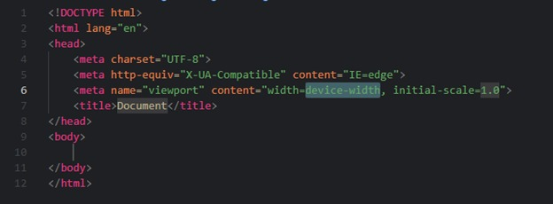  

 

**HTML Anatomy**  
HTML Anatomy didefenisikan dengan Opening Tag, content dan closing tag. Dan kesemuanya tersusun di dalam element.  

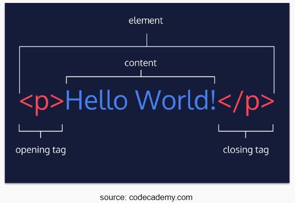  

 

**HTML Element**  

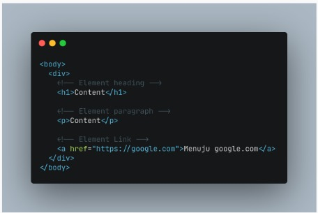  

 

**HTML Atribut**  
Atribut adalah properties dari sebuah HTML. Semua HTML memiliki attribute.  
Contoh atribuat pada HTML :  

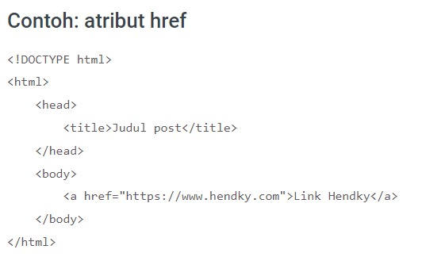  

 

**Comment pada HTML**  
Coment dapat dilihat dengan yg bertanda <!--  - - >  
Coment hanya bisa dibaca sesame programmer  

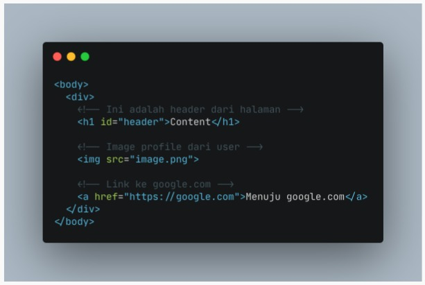  

 

**Cara menjalankan HTML**
Kita dapat menjalankan HTML dengan mencari lokasi file HTML lalu membukanya di browser.  

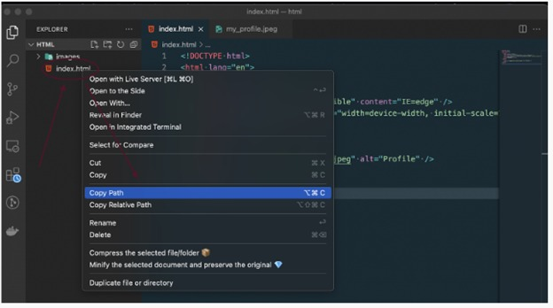  

yang akan menghasilkan :  

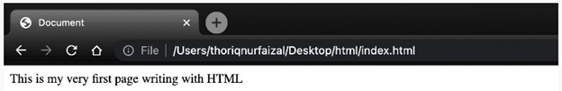  

 

Jika kita kesulitan dsetiap ada perubahan ada keribetan dengan refresh browser terus menerus, kita dapat menggunakan Live Server pada Visual Studio Code.  

Tidak semua HTML Element memiliki content, seperi element.  
Element ini disebut dengan empty element. Empty element tidak memiliki closing tag.  

 

**Cara memasukkan gambar pada HTML**  

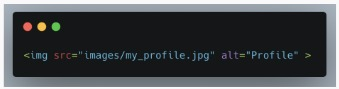  

Di src=” “ yang diisi adalh lokasi foto berada. Sedangkan alt=” “ adalah jikalau terjadi kesalahan pada gambar sehingga kita tetap mengetahui foto apakah itu.  

 

**Cara memasukkan video pada HTML**  

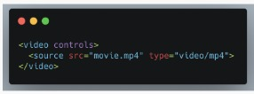  

Video merupakan double closing tag sehingga kita menaruh konten di antara opening dan closing tag.  

 

**Cara membuat table pada HTML**  

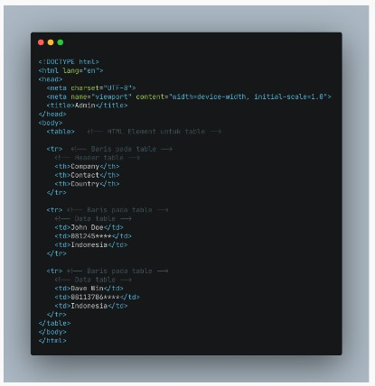  

Table ini akan menghasilkan :  
  

 

**Contoh kodingan membuat form**  

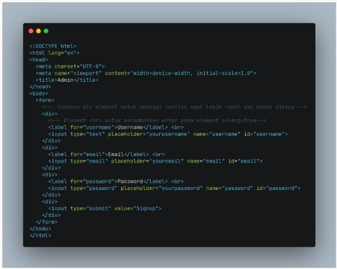  

Akan menghasilkan :  

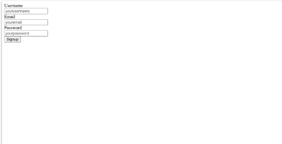  

 

**Semantic pada HTML**  
Semantic artinya menggunakan element HTML yang sesuai dengan kebutuhan konten.  
Semisal daripada kita menuliskan < div class=”header” kita dapat menulisnya dengan < header >  
Kegunaan semantic HTML :  
* meingkatkan Accessbility
* meningkatkan SEO
* lebih mudah di maintain
